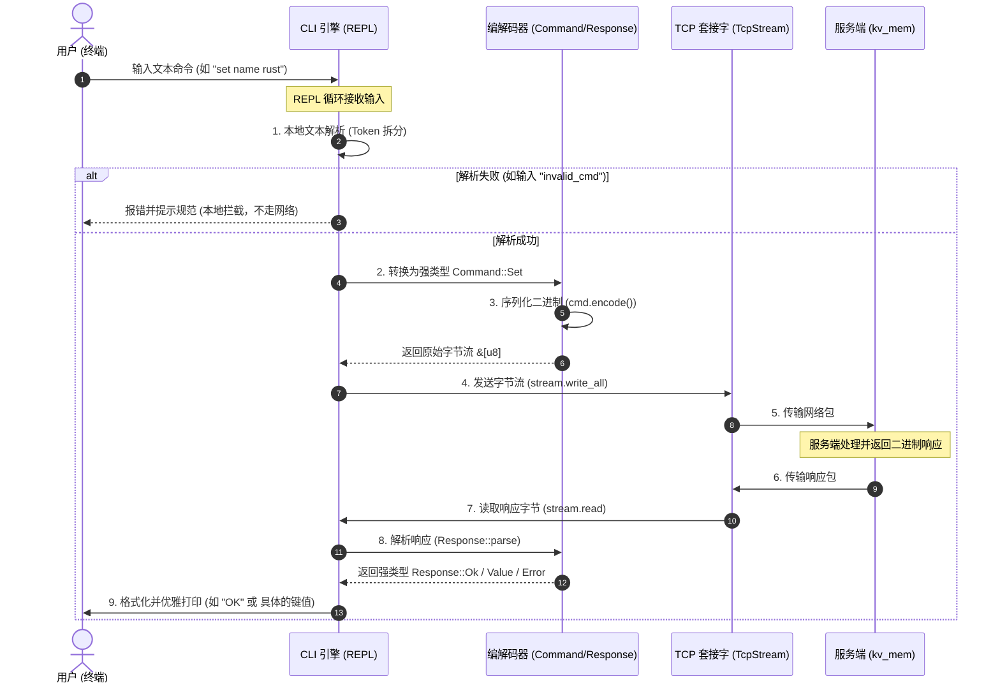

```mermaid
sequenceDiagram
    autonumber
    actor User as 用户 (终端)
    participant CLI as CLI 引擎 (REPL)
    participant Codec as 编解码器 (Command/Response)
    participant Socket as TCP 套接字 (TcpStream)
    participant Server as 服务端 (kv_mem)

    User->>CLI: 输入文本命令 (如 "set name rust")
    Note over CLI: REPL 循环接收输入
    
    CLI->>CLI: 1. 本地文本解析 (Token 拆分)
    
    alt 解析失败 (如输入 "invalid_cmd")
        CLI-->>User: 报错并提示规范 (本地拦截，不走网络)
    else 解析成功
        CLI->>Codec: 2. 转换为强类型 Command::Set
        Codec->>Codec: 3. 序列化二进制 (cmd.encode())
        Codec-->>CLI: 返回原始字节流 &[u8]
        
        CLI->>Socket: 4. 发送字节流 (stream.write_all)
        Socket->>Server: 5. 传输网络包
        
        Note over Server: 服务端处理并返回二进制响应
        
        Server->>Socket: 6. 传输响应包
        Socket->>CLI: 7. 读取响应字节 (stream.read)
        
        CLI->>Codec: 8. 解析响应 (Response::parse)
        Codec-->>CLI: 返回强类型 Response::Ok / Value / Error
        
        CLI->>User: 9. 格式化并优雅打印 (如 "OK" 或 具体的键值)
    end
```