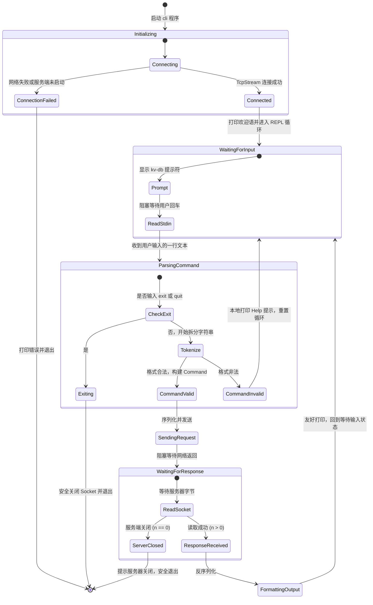

```mermaid
stateDiagram-v2
    [*] --> Initializing : 启动 cli 程序
    
    state Initializing {
        [*] --> Connecting
        Connecting --> Connected : TcpStream 连接成功
        Connecting --> ConnectionFailed : 网络失败或服务端未启动
    }
    
    ConnectionFailed --> [*] : 打印错误并退出
    
    Connected --> WaitingForInput : 打印欢迎语并进入 REPL 循环
    
    state WaitingForInput {
        [*] --> Prompt : 显示 kv-db 提示符
        Prompt --> ReadStdin : 阻塞等待用户回车
    }
    
    ReadStdin --> ParsingCommand : 收到用户输入的一行文本
    
    state ParsingCommand {
        [*] --> CheckExit : 是否输入 exit 或 quit
        CheckExit --> Exiting : 是
        CheckExit --> Tokenize : 否，开始拆分字符串
        Tokenize --> CommandValid : 格式合法，构建 Command
        Tokenize --> CommandInvalid : 格式非法
    }
    
    CommandInvalid --> WaitingForInput : 本地打印 Help 提示，重置循环
    Exiting --> [*] : 安全关闭 Socket 并退出
    
    CommandValid --> SendingRequest : 序列化并发送
    SendingRequest --> WaitingForResponse : 阻塞等待网络返回
    
    state WaitingForResponse {
        [*] --> ReadSocket : 等待服务器字节
        ReadSocket --> ResponseReceived : 读取成功 (n > 0)
        ReadSocket --> ServerClosed : 服务端关闭 (n == 0)
    }
    
    ServerClosed --> [*] : 提示服务器关闭，安全退出
    ResponseReceived --> FormattingOutput : 反序列化
    FormattingOutput --> WaitingForInput : 友好打印，回到等待输入状态
```