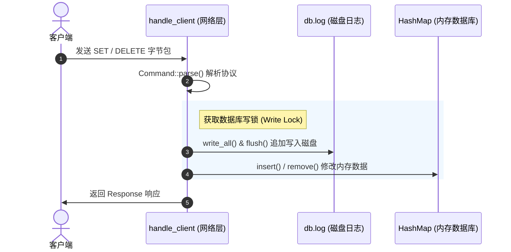
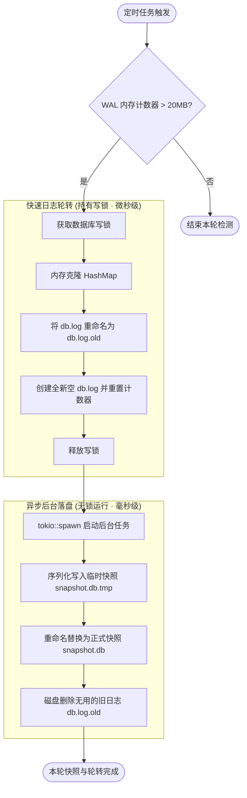
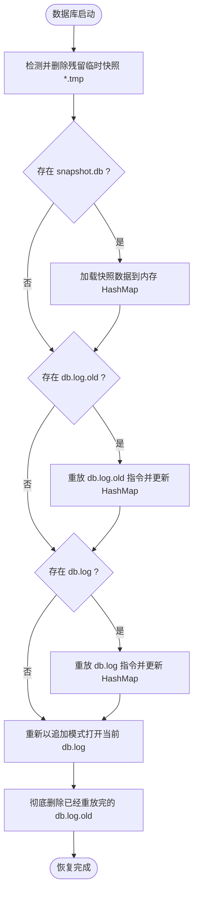

# wal、snapshot数据的存储内存数据的恢复分析

## wal写入流程

```mermaid
sequenceDiagram
    autonumber
    actor Client as 客户端
    participant Server as handle_client (网络层)
    participant WAL as db.log (磁盘日志)
    participant Mem as HashMap (内存数据库)

    Client->>Server: 发送 SET / DELETE 字节包
    Server->>Server: Command::parse() 解析协议
    
    rect rgb(240, 248, 255)
        note right of Server: 获取数据库写锁 (Write Lock)
        Server->>WAL: write_all() & flush() 追加写入磁盘
        Server->>Mem: insert() / remove() 修改内存数据
    end
    
    Server->>Client: 返回 Response 响应
```

## snapshot存储逻辑

```mermaid
graph TD
    Start([定时任务触发]) --> Check{WAL 内存计数器 > 20MB?}
    Check -- 否 --> End1([结束本轮检测])
    Check -- 是 --> Lock[获取数据库写锁]
    
    subgraph id1 ["快速日志轮转 (持有写锁 · 微秒级)"]
        Lock --> Clone[内存克隆 HashMap]
        Clone --> Rename[将 db.log 重命名为 db.log.old]
        Rename --> Create[创建全新空 db.log 并重置计数器]
        Create --> Release[释放写锁]
    end

    Release --> Spawn[tokio::spawn 启动后台任务]
    
    subgraph id2 ["异步后台落盘 (无锁运行 · 毫秒级)"]
        Spawn --> WriteTmp[序列化写入临时快照 snapshot.db.tmp]
        WriteTmp --> AtomicRename[重命名替换为正式快照 snapshot.db]
        AtomicRename --> DeleteOld[磁盘删除无用的旧日志 db.log.old]
    end
    
    DeleteOld --> End2([本轮快照与轮转完成])
```

## 内存数据恢复逻辑

```mermaid
graph TD
    Start([数据库启动]) --> CleanTmp[检测并删除残留临时快照 *.tmp]
    CleanTmp --> CheckSnap{存在 snapshot.db ?}
    
    CheckSnap -- 是 --> LoadSnap[加载快照数据到内存 HashMap]
    CheckSnap -- 否 --> CheckOldLog{存在 db.log.old ?}
    LoadSnap --> CheckOldLog
    
    CheckOldLog -- 是 --> ReplayOld[重放 db.log.old 指令并更新 HashMap]
    CheckOldLog -- 否 --> CheckLog{存在 db.log ?}
    ReplayOld --> CheckLog
    
    CheckLog -- 是 --> ReplayLog[重放 db.log 指令并更新 HashMap]
    CheckLog -- 否 --> CreateWAL[重新以追加模式打开当前 db.log]
    ReplayLog --> CreateWAL
    
    CreateWAL --> DeleteOldLog[彻底删除已经重放完的 db.log.old]
    DeleteOldLog --> Success([恢复完成])
```
